# Airport API Discrepancy Summary

Generated: 2026-04-12

## Max Discrepancy Summary

| Airport | API | Max Overcount | Max Undercount | Days Compared |
|---------|-----|---------------|----------------|---------------|
| DXB | AeroDataBox | 55.8% (2026-04-12) | 1.4% (2026-04-07) | 10 |
| DXB | OpenSky | N/A | 92.6% (2026-04-11) | 9 |
| AUH | AeroDataBox | 100.0% (2026-04-12) | 53.8% (2026-04-04) | 5 |
| DOH | AeroDataBox | N/A | 84.8% (2026-04-07) | 10 |
| DOH | OpenSky | N/A | 96.1% (2026-04-05) | 9 |
| JED | AeroDataBox | N/A | 42.7% (2026-04-09) | 10 |

## Diagrams

### DXB (Dubai International (DXB))

#### 1. Daily Flight Counts (Bar Chart)

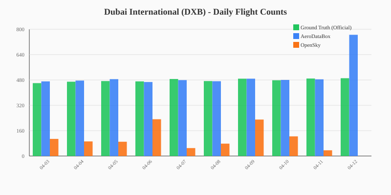

#### 2. Discrepancy Percentages

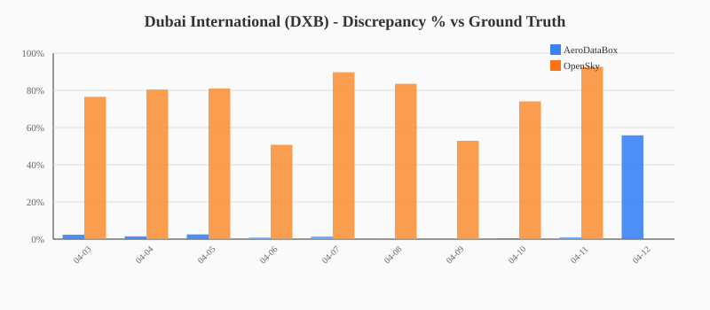

#### 3. Flight Count Trends

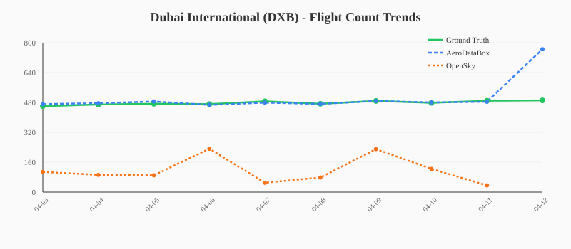

---

### AUH (Abu Dhabi Intl (AUH))

#### 1. Daily Flight Counts (Bar Chart)

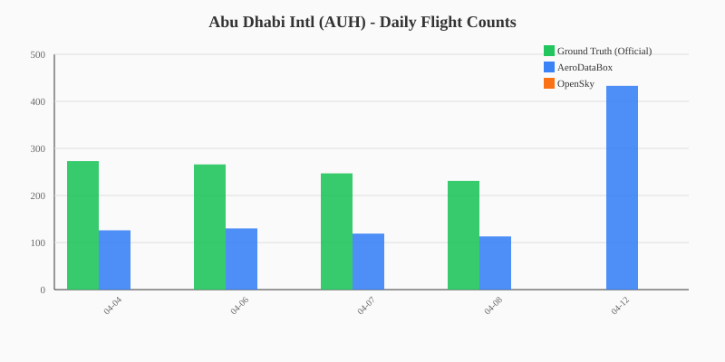

#### 2. Discrepancy Percentages

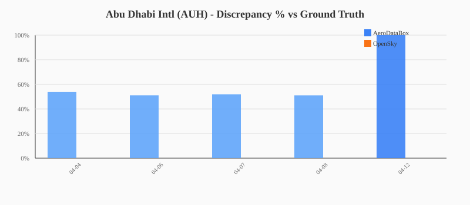

#### 3. Flight Count Trends

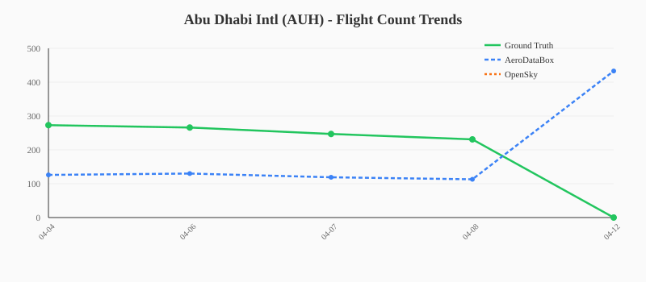

---

### DOH (Hamad Intl (DOH))

#### 1. Daily Flight Counts (Bar Chart)

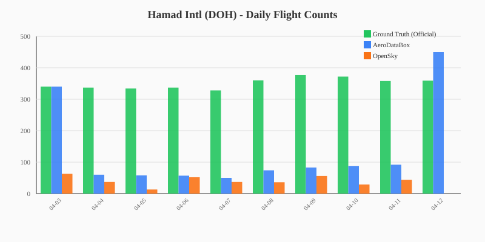

#### 2. Discrepancy Percentages

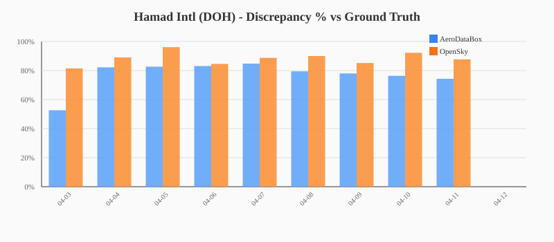

#### 3. Flight Count Trends

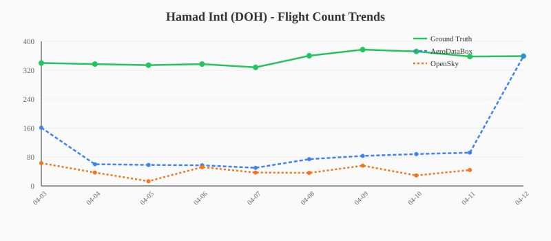

---

### JED (Jeddah (JED))

#### 1. Daily Flight Counts (Bar Chart)

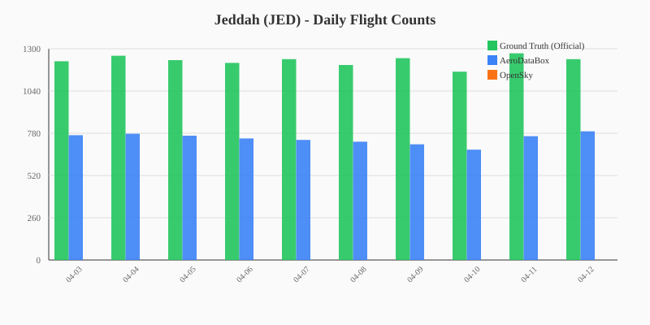

#### 2. Discrepancy Percentages

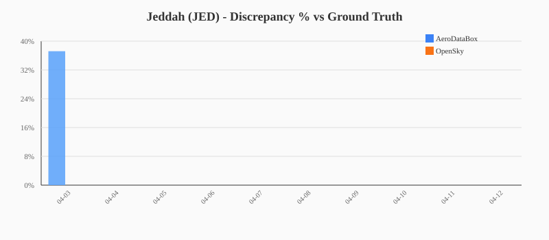

#### 3. Flight Count Trends

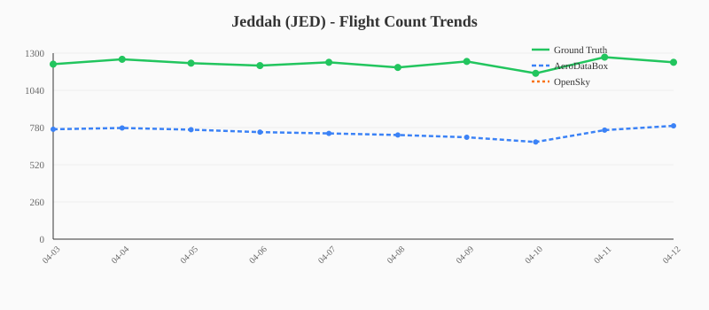

---

